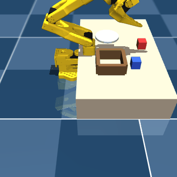
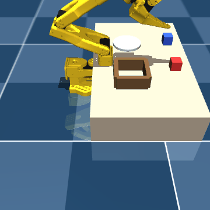
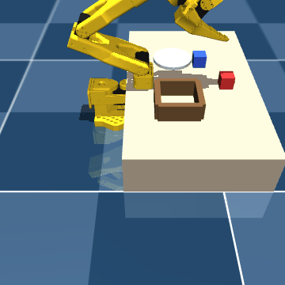

# H200 run — 2026-07-06

First correctly-measured baseline **and** a lever that beats it, on an H200 (NVL,
143 GB). 120 scripted-expert sim episodes, SmolVLA-base finetune (frozen expert-only,
100M trainable of 450M), 6000 steps, batch 64, bf16. Checkpoints judged by
**closed-loop success** on 6 non-stacking commands (`0,1,2,3,6,7`) — the metric we
proved is trustworthy (offline loss is decoupled from it).

## Result

| run | lever | peak closed-loop | final (step 6000) |
|---|---|---|---|
| **A — baseline** | `n_action_steps=50` (base default) | 2/6 (33%) | 1/6 (17%) |
| **B — lever** | `n_action_steps=10` | **3/6 (50%)** | **3/6 (50%)** |

**Takeaway:** dropping `n_action_steps` from 50 → 10 (fewer open-loop steps between
replans → less compounding drift) gave a **higher, faster peak** — the first change
we've made that provably beats the baseline on the honest metric. Both runs are
noisy (6 commands is coarse) and both are frozen-brain on only 120 episodes, so this
is a *lever comparison*, not a finished policy.

### Full trajectories

**A (`n_action_steps=50`)** — see [train_A_closedloop.log](train_A_closedloop.log)
```
1000: 1/6 (17%)   2000: 1/6 (17%)   3000: 1/6 (17%)
4000: 2/6 (33%)   5000: 1/6 (17%)   6000: 1/6 (17%)
```
**B (`n_action_steps=10`)** — see [train_B_closedloop.log](train_B_closedloop.log)
```
1000: 3/6 (50%)   2000: 2/6 (33%)   3000: 2/6 (33%)
4000: 1/6 (17%)   5000: 1/6 (17%)   6000: 3/6 (50%)
```

## Rollout clips (Step B checkpoint)

⚠️ These GIFs were re-rendered locally on **MPS** (the training box became too
contended by other vast.ai tenants to render). MPS's different numerics tip this
*marginal* policy toward misses (0/6 locally vs the **3/6** it scores on CUDA), so
they **under-represent** it. What they honestly show: the arm reads each instruction
and drives to the correct cube (min-dist ~0.03), then misses the precise grasp/place
— the compounding-error story, visualized.

| command | clip |
|---|---|
| "Pick up the red cube and place it in the box." |  |
| "Put the red cube on the plate." |  |
| "Put the red cube in the box and the blue cube on the plate." |  |

(All six under [gifs/](gifs/).)

## Bugs found (to fix)

1. **`load_policy` ignores a checkpoint's saved `n_action_steps`** — it builds a
   fresh `SmolVLAConfig` with the default (50), so a reloaded B checkpoint ran at 50
   until patched. Affects eval/serving/recipe reloads.
2. **`train.py` doesn't keep the best-closed-loop checkpoint** — it saves at
   `save-every`, so peak checkpoints (e.g. B @ step 1000 = 50%) weren't retained.
   `recover.py` has `--save-best-closed-loop`; `train.py` should too.

## Repro

```bash
# baseline
python -m tinyvla.train --repo-id local/pickplace --root data/pickplace \
  --steps 6000 --batch-size 64 --num-workers 16 --device cuda \
  --closed-loop-every 1000 --closed-loop-commands 0,1,2,3,6,7 --closed-loop-cap 220
# lever
python -m tinyvla.train ... --n-action-steps 10
```
See [docs/h100_recipe.md](../../docs/h100_recipe.md) for the full A→D plan.
Checkpoint weights (`model.safetensors`, 1.2 GB) not committed — regenerate via repro.
